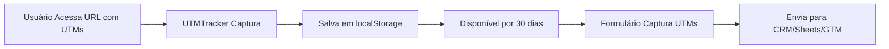

# Guia de UTM Tracking

## 📊 Sistema de Rastreamento de UTM Parameters

Este sistema captura, persiste e rastreia automaticamente os parâmetros UTM de todas as campanhas de marketing.

## 🎯 Funcionalidades

### 1. Captura Automática
Os UTMs são capturados automaticamente quando o usuário acessa qualquer página com parâmetros UTM na URL.

**Exemplo de URL com UTMs:**
```
https://robertonavarrooficial.com.br/eventos/segredos-da-mente-milionaria?utm_source=facebook&utm_medium=cpc&utm_campaign=mente_milionaria_2025&utm_term=educacao_financeira&utm_content=video_testimonial
```

### 2. Persistência em localStorage
Os UTMs são salvos no `localStorage` do navegador por **30 dias**, garantindo que:
- O usuário não perca os UTMs ao navegar entre páginas
- Os formulários de conversão sempre tenham os dados de origem
- A atribuição seja mantida mesmo em sessões futuras

### 3. Envio Automático
Todos os formulários do site (`NewsletterFormacoes`, etc.) capturam e enviam automaticamente os UTMs para:
- **Kommo CRM** (webhook específico por formulário/evento)
- **Google Sheets** (sempre ativo)
- **LeadLovers** (sempre ativo)
- **Google Tag Manager (GTM)** (via dataLayer)

#### Webhooks por Formulário

Cada formulário tem seu próprio webhook do Kommo configurado hardcoded no arquivo `lib/actions.ts`. O sistema identifica automaticamente qual webhook usar baseado no `source` do formulário:

- **Energia do Dinheiro**: Webhook específico
- **Mentor Milionário**: Webhook específico
- **Crenças da Riqueza**: Webhook específico
- **Segredos da Mente Milionária**: Webhook específico
- **Outros**: Webhook padrão (Educador Financeiro)

Para adicionar um novo webhook, edite o objeto `WEBHOOK_URLS` em `lib/actions.ts` e adicione a chave correspondente ao `source` do formulário.

## 🔧 Como Funciona

### Componentes Principais

#### 1. `UTMTracker` (components/utm-tracker.tsx)
Componente global que inicializa a captura de UTMs ao carregar qualquer página.

```tsx
// Já está configurado no layout principal
<UTMTracker />
```

#### 2. `getUTMParameters()` (lib/utils.ts)
Função que captura e retorna os parâmetros UTM:

```typescript
import { getUTMParameters } from '@/lib/utils'

const utmParams = getUTMParameters()
// Retorna:
// {
//   utm_source: 'facebook',
//   utm_medium: 'cpc',
//   utm_campaign: 'mente_milionaria_2025',
//   utm_term: 'educacao_financeira',
//   utm_content: 'video_testimonial'
// }
```

### Fluxo de Captura



## 📝 Usando em Formulários

### Exemplo com NewsletterFormacoes

```tsx
import { NewsletterFormacoes } from '@/components/newsletter-formacoes'

export default function MinhaPage() {
  return (
    <NewsletterFormacoes
      source="Meu Evento"
      title="Garanta Sua Vaga"
      description="Inscreva-se agora"
      ctaText="QUERO PARTICIPAR"
      // UTMs são capturados automaticamente
      onSubmit={() => {}}
    />
  )
}
```

O componente automaticamente:
1. Captura os UTMs salvos no localStorage
2. Inclui no `formData` antes do envio
3. Envia para todos os sistemas integrados

## 🧪 Testando o Sistema

### 1. Testar Captura de UTMs

Acesse uma página com parâmetros UTM:
```
http://localhost:3000/eventos/segredos-da-mente-milionaria?utm_source=teste&utm_medium=email&utm_campaign=teste_2025
```

### 2. Verificar no Console

Abra o DevTools e veja os logs:
```javascript
// No console do navegador
localStorage.getItem('utm_params')
// Deve retornar: {"utm_source":"teste","utm_medium":"email",...}
```

### 3. Verificar Envio

Preencha um formulário e veja os logs do servidor:
```bash
Enviando dados para Kommo: {
  name: 'João Silva',
  email: 'joao@email.com',
  ...
  utm_source: 'teste',
  utm_medium: 'email',
  utm_campaign: 'teste_2025',
  ...
}
```

## 🔍 Debugging

### UTMs não estão sendo capturados?

1. **Verifique a URL:**
   - Os parâmetros estão corretos?
   - Use `?` antes do primeiro e `&` entre os demais

2. **Verifique o localStorage:**
   ```javascript
   // No console do navegador
   console.log(localStorage.getItem('utm_params'))
   ```

3. **Verifique o console:**
   - Em desenvolvimento, o sistema faz log dos UTMs capturados

### UTMs aparecem como `undefined`?

1. **Limpe o localStorage:**
   ```javascript
   localStorage.removeItem('utm_params')
   localStorage.removeItem('utm_timestamp')
   ```

2. **Recarregue com UTMs na URL:**
   ```
   http://localhost:3000/?utm_source=facebook&utm_medium=cpc
   ```

## 📊 Parâmetros UTM Suportados

| Parâmetro | Descrição | Exemplo |
|-----------|-----------|---------|
| `utm_source` | Origem do tráfego | `facebook`, `google`, `instagram` |
| `utm_medium` | Meio/canal | `cpc`, `email`, `social`, `organic` |
| `utm_campaign` | Nome da campanha | `mente_milionaria_2025` |
| `utm_term` | Palavra-chave (ads) | `educacao_financeira` |
| `utm_content` | Variação do anúncio | `video_testimonial`, `banner_a` |

## 🎯 Boas Práticas

### Nomenclatura de Campanhas

```
utm_campaign=produto_mes_numero
Exemplo: utm_campaign=mente_milionaria_janeiro_01
```

### URLs Completas

```
https://robertonavarrooficial.com.br/eventos/segredos-da-mente-milionaria
  ?utm_source=facebook
  &utm_medium=paid
  &utm_campaign=mente_milionaria_2025
  &utm_term=transformacao_financeira
  &utm_content=video_depoimento_v1
```

### Ferramentas Úteis

- **Google Campaign URL Builder:** https://ga-dev-tools.google/campaign-url-builder/
- **Encurtador de URL:** bit.ly, tinyurl.com (preserve os parâmetros!)

## 🔐 Segurança e Privacidade

- ✅ UTMs são armazenados apenas no navegador do usuário
- ✅ Dados são limpos automaticamente após 30 dias
- ✅ Nenhum dado sensível é armazenado
- ✅ Conformidade com LGPD

## 📞 Suporte

Em caso de problemas, verifique:
1. Console do navegador (F12)
2. Logs do servidor
3. Documentação do Next.js: https://nextjs.org

---

**Última atualização:** Outubro 2025

